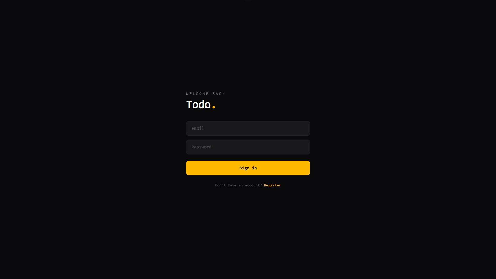
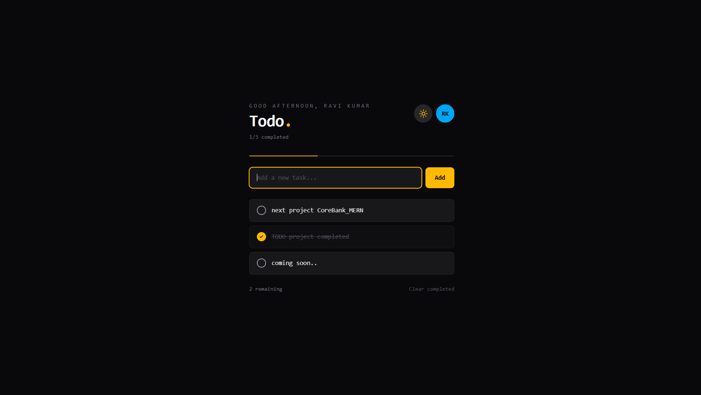

# 📝 Todo App — MERN Stack

A full-stack Todo application built with MongoDB, Express, React, and Node.js.  
Features JWT authentication, user profiles, dark/light mode, and a clean minimal UI.


---

## 🌐 Live Demo

> 🚀 **Live Site:** [your-live-link-here.com](https://your-live-link-here.com)

---

## 📸 Screenshots
###  Dashboard Overview


## DashBord Page



---

## ✨ Features

- 🔐 JWT Authentication (Register / Login / Logout)
- 👤 User avatar with initials + dropdown menu
- 🌙 Dark / Light mode toggle
- ✅ Create, complete, and delete todos
- 📊 Progress bar + task stats
- 💬 Time-based greeting (Good morning / afternoon / evening)
- ⚡ Enter key to quickly add tasks
- 🗑️ Clear all completed todos at once
- 🔒 Protected routes — redirects to login if not authenticated

---

## 🗂️ Project Structure

```
todo-app/
├── TODO-backend/
│   ├── controllers/
│   │   ├── authController.js    # Register, Login logic
│   │   └── todoController.js    # Todo CRUD logic
│   ├── middlewares/
│   │   └── authlogin.js         # JWT verify middleware
│   ├── model/
│   │   ├── Todo.js              # Todo schema
│   │   └── users.js             # User schema
│   ├── routes/
│   │   ├── authRoutes.js        # /api/auth routes
│   │   └── routes.js            # /api/todos routes
│   ├── .env                     # Environment variables (not pushed)
│   ├── index.js                 # Entry point
│   └── package.json
│
└── TODO-frontend/
    ├── src/
    │   ├── api/
    │   │   └── api.js           # Base URL + auth headers
    │   ├── components/
    │   │   └── ProtectedRoute.jsx
    │   ├── pages/
    │   │   ├── Dashboard.jsx    # Main todo page
    │   │   ├── Login.jsx
    │   │   └── Register.jsx
    │   ├── App.jsx
    │   └── main.jsx
    ├── index.html
    └── package.json
```

---

## ⚙️ Getting Started

### Prerequisites

- Node.js v18+
- MongoDB (local or [MongoDB Atlas](https://www.mongodb.com/atlas))

---

### 1. Clone the repo

```bash
git clone https://github.com/RaviranjanMishra01/Todo_APP_MERN.git
cd todo-app
```

---

### 2. Backend Setup

```bash
cd TODO-backend
npm install
```

Create a `.env` file in the `TODO-backend` folder:

```env
PORT=5000
MONGO_URL=mongodb://localhost:27017/tododb
JWT_SECRET=your_secret_key_here
```

Start the backend server:

```bash
npm run dev
```

Server runs on `http://localhost:5000`

---

### 3. Frontend Setup

```bash
cd TODO-frontend
npm install
npm run dev
```

App runs on `http://localhost:5173`

---

## 🔗 API Endpoints

### Auth — `/api/auth`

| Method | Endpoint             | Description            | Auth |
|--------|----------------------|------------------------|------|
| POST   | `/api/auth/register` | Create a new account   | ❌   |
| POST   | `/api/auth/login`    | Login and get token    | ❌   |
| GET    | `/api/auth/me`       | Get logged-in user     | ✅   |

### Todos — `/api/todos`

| Method | Endpoint          | Description            | Auth |
|--------|-------------------|------------------------|------|
| GET    | `/api/todos`      | Get all todos          | ✅   |
| POST   | `/api/todos`      | Create a new todo      | ✅   |
| PUT    | `/api/todos/:id`  | Toggle todo complete   | ✅   |
| DELETE | `/api/todos/:id`  | Delete a todo          | ✅   |

> All protected routes require `Authorization: Bearer <token>` header.

---

## 🗄️ Database Models

### User
```js
{
  username:  String  // required
  email:     String  // required, unique
  password:  String  // bcrypt hashed
}
```

### Todo
```js
{
  title:     String   // required
  completed: Boolean  // default: false
  user:      ObjectId // ref: User
}
```

---

## 🔐 Auth Flow

```
Register → Login → JWT token saved to localStorage → Access Dashboard
                                                    ↓
                                         Token missing or invalid
                                                    ↓
                                           Redirect to /login
```

---

## 🚀 Deployment

| Part     | Recommended Platform |
|----------|----------------------|
| Frontend | [Vercel](https://vercel.com) |
| Backend  | [Render](https://render.com) |
| Database | [MongoDB Atlas](https://www.mongodb.com/atlas) |

After deploying, update the frontend `src/api/api.js`:

```js
const API = "https://your-backend.onrender.com";
```

And update the backend `index.js` CORS origin:

```js
app.use(cors({
  origin: "https://your-frontend.vercel.app",
  credentials: true
}));
```

---

## 📦 Scripts

### Backend
```bash
npm start      # node index.js
npm run dev    # nodemon index.js
```

### Frontend
```bash
npm run dev    # development server
npm run build  # production build
```

---

## 🛡️ Security Notes

- Passwords are hashed using `bcryptjs` (10 salt rounds)
- JWT tokens expire after **7 days**
- `.env` file is gitignored — never push secrets to GitHub
- Each user can only access their own todos

---

## 📄 License

This project is open source and available under the [MIT License](LICENSE).

---

## 🙋‍♂️ Author

**Your Name**  
GitHub: [@RaviranjanMishra01](https://github.com/your-username)